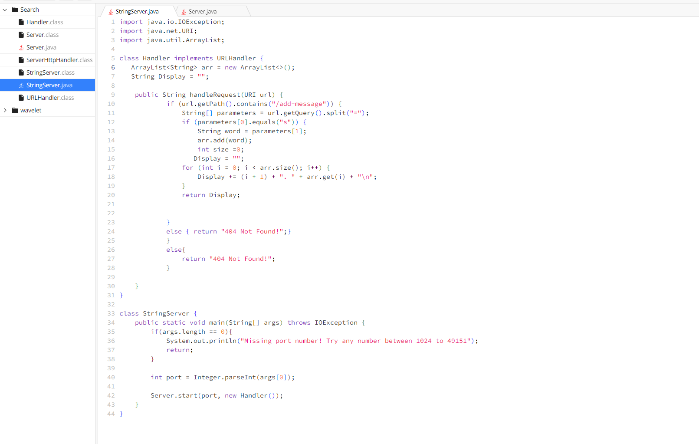
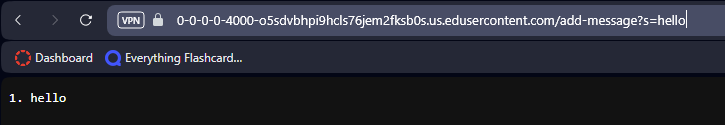

# Lab Report 2
---

---

---

---
1. The methods in my code are called 'handleRequest()' located in the Handler class and 'main()' which is located in the StringServer class.
2. The relevant arguments to 'handleRequest()' is the URI url argument within the parentheses. This argument is used to handle the url that is given to the method so that the server can handle it and allow the rest of the code within the mothod to work.  
   > Other relevant fields within the class include 'ArrayList<String> arr' as in there it holds the requests that is recieved from the url.  
   > The next field is the 'String Display' as it prepares the array list to correctly print out the requests it had recieved. 
3. The values of the 'Display' and 'arr' field change because they are updated for every request that comes in.  
## Part 2
---

1. Path to Private Key:/Users/pedroarias/.ssh/id_rsa
2. Path To Public Key: /Users/pedroarias/.ssh/id_rsa.pub

   ## Part 3
   ---
   In weeks 2 and 3 of the lab I learned how to connect to a remote computer and access items inside of its directories. Before I thought it had to be this complicated process to remotely connect to another desktop and to view and transfer files but now I realize that it is as simple(yet still complicated) as inputting a few things in a command line so long as you have the credentials. I found this to be pretty cool as I've never actually remotely accessed a computer before. 
